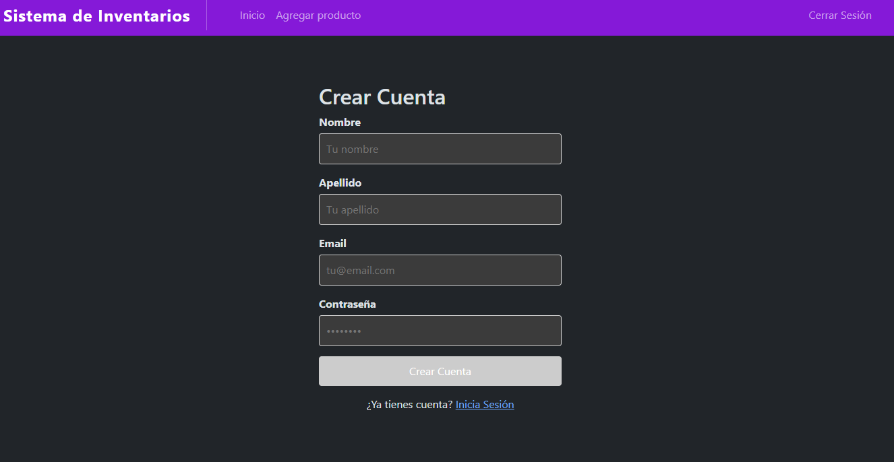
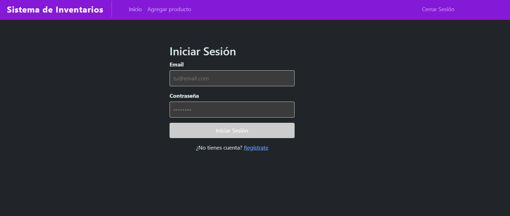
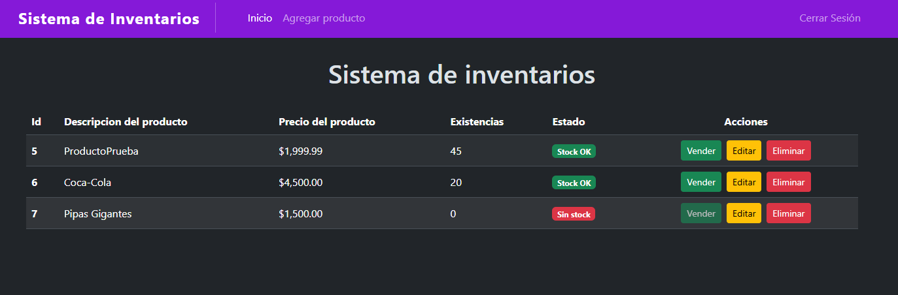
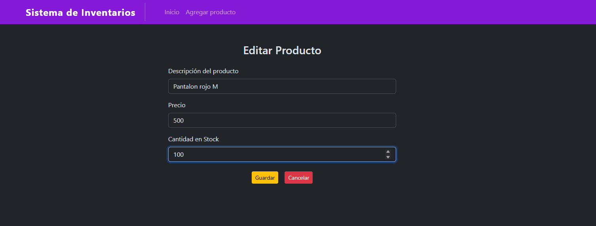

# 📦 Sistema de Gestión de Inventario - SaaS Multiusuario

Aplicación **Full Stack** para la gestión de productos de inventario desarrollada con **Angular en el frontend** y **Spring Boot en el backend**, utilizando una arquitectura REST para la comunicación entre cliente y servidor.

Este proyecto es una **plataforma SaaS multiusuario** donde cada usuario puede registrarse, iniciar sesión y gestionar sus propios productos de manera aislada.

---

# 🧠 Arquitectura del Sistema

La aplicación sigue una arquitectura **cliente-servidor** con autenticación JWT.

El frontend desarrollado en Angular consume una **API REST** desarrollada con Spring Boot, la cual gestiona la lógica de negocio y la persistencia de datos en MySQL.


---

# 🚀 Tecnologías Utilizadas

## Backend
- **Java 21** con Spring Boot 3.4.2
- Spring Security + JWT (autenticación stateless)
- Spring Data JPA + Hibernate
- MySQL 8.0
- Maven

## Frontend
- **Angular 21** (standalone components)
- TypeScript
- Bootstrap 5
- RxJS

## Despliegue
- **Backend**: Railway
- **Frontend**: Vercel

## Herramientas
- Postman (testing de endpoints)
- Git / GitHub
- IntelliJ IDEA / VS Code

---

# 📸 Interfaz de Usuario

## 🔐 Registro de Usuario

Pantalla de registro para crear una nueva cuenta de usuario.



---

## 🔐 Inicio de Sesión

Pantalla de login con autenticación JWT.



---

## 📋 Lista de Productos

Vista principal donde se muestran todos los productos del usuario autenticado.
- Estados de stock con badges visuales (Sin stock, Stock bajo, Stock OK)
- Botones de acción: Vender, Editar, Eliminar



---

## ➕ Agregar Producto

Formulario para registrar nuevos productos en el sistema.


---

## ✏️ Editar Producto

Formulario para modificar los datos de un producto existente.



---

# 💡 Características del Sistema

## ✅ Autenticación y Seguridad
- Registro y login de usuarios con JWT
- Contraseñas encriptadas con BCrypt
- Roles de usuario (USER, ADMIN)
- Rutas protegidas con Auth Guard

## ✅ Sistema Multiusuario
- Aislamiento de datos por usuario
- Cada usuario solo ve sus propios productos
- Filtrado automático en todas las operaciones CRUD

## ✅ Gestión de Inventario
- CRUD completo de productos
- Estados de stock visual (verde/amarillo/rojo)
- Modal de venta para registrar salidas
- Validación de datos en formularios

## ✅ APIs RESTful
- Documentación con Swagger/OpenAPI
- Endpoints REST estándar
- Manejo de errores profesional con GlobalExceptionHandler

## ✅ Testing
- Tests unitarios con JUnit 5 y Mockito
- 13 tests pasando en AuthService y ProductoServicio

## ✅ Despliegue
- Backend deployado en Railway
- Frontend deployado en Vercel
- Configuración para producción

---

# 📂 Estructura del Proyecto
```text
inventario-fullstack/
│
├── backend/
│   └── inventarios/
│       ├── src/main/java/gm/inventarios/
│       │   ├── auth/          # JWT, AuthController, AuthService
│       │   ├── config/        # SecurityConfig
│       │   ├── controlador/   # ProductoControlador
│       │   ├── servicio/      # ProductoServicio, IProductoServicio
│       │   ├── repositorio/   # ProductoRepositorio
│       │   ├── modelo/        # Entidades JPA
│       │   ├── excepciones/   # GlobalExceptionHandler
│       │   └── security/      # UsuarioActual, UserDetailsService
│       │
│       ├── src/main/resources/
│       │   └── application.properties
│       │
│       └── pom.xml
│
├── frontend/
│   └── inventario-app/
│       ├── src/app/
│       │   ├── login/         # Componente de login
│       │   ├── register/      # Componente de registro
│       │   ├── producto-lista/ # Lista de productos
│       │   ├── agregar-producto/
│       │   ├── editar-producto/
│       │   ├── auth.service.ts
│       │   └── producto.service.ts
│       │
│       └── angular.json
│
└── README.md
```

---

# 🔧 Configuración e Instalación

## Requisitos Previos
- Java 21+
- Node.js 18+
- Angular CLI 18+
- Maven 3.9+
- MySQL 8.0+

## ▶️ Ejecutar el Backend (Desarrollo)

```bash
cd backend/inventarios
mvn spring-boot:run
```

El backend correrá en: `http://localhost:8080`

Swagger UI: `http://localhost:8080/swagger-ui/index.html`

## ▶️ Ejecutar el Frontend (Desarrollo)

```bash
cd frontend/inventario-app
npm install
ng serve
```

Abrir en el navegador: `http://localhost:4200`

---

# 🌐 Deploy en Producción

🔗 **Demo:** [https://inventario-app-tawny.vercel.app](https://inventario-app-tawny.vercel.app)

---

# 📌 Endpoints de la API

| Método | Endpoint | Descripción |
|--------|----------|-------------|
| POST | `/api/auth/register` | Registrar nuevo usuario |
| POST | `/api/auth/login` | Iniciar sesión |
| GET | `/inventario-app/productos` | Listar productos del usuario |
| POST | `/inventario-app/productos` | Crear producto |
| GET | `/inventario-app/productos/{id}` | Obtener producto por ID |
| PUT | `/inventario-app/productos/{id}` | Actualizar producto |
| DELETE | `/inventario-app/productos/{id}` | Eliminar producto |

**Nota**: Todos los endpoints de productos requieren autenticación JWT (excepto register y login).

---

# 🧪 Testing

Ejecutar tests unitarios:
```bash
cd backend/inventarios
mvn test
```

**Resultados**: 13 tests passing (AuthServiceTest, ProductoServicioTest)

---

# 👨‍💻 Autor

 **Gustavo Plaza** 
- Desarrollo Full Stack con Java/Spring Boot y Angular
- Arquitecturas RESTful seguras
- Sistemas multiusuario con JWT
- Despliegue en la nube (Railway, Vercel)
- Buenas prácticas de código y testing
