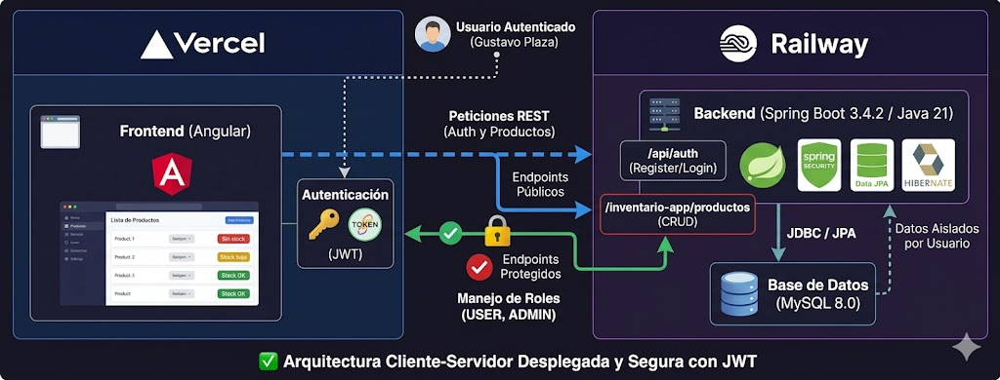

# 📦 Sistema de Gestión de Inventario

Aplicación **Full Stack** para la gestión de productos de inventario desarrollada con **Angular en el frontend** y **Spring Boot en el backend**, utilizando una arquitectura REST para la comunicación entre cliente y servidor.

Este proyecto permite administrar productos mediante operaciones CRUD completas (crear, leer, actualizar y eliminar).

---

# 🧠 Arquitectura del Sistema

La aplicación sigue una arquitectura **cliente-servidor**.

El frontend desarrollado en Angular consume una **API REST** desarrollada con Spring Boot, la cual gestiona la lógica de negocio y la persistencia de datos en MySQL.



---

# 🚀 Tecnologías Utilizadas

## Backend
- Java 17+
- Spring Boot
- Spring Data JPA
- Hibernate
- MySQL
- Maven

## Frontend
- Angular
- TypeScript
- Zod (validación de datos)
- Bootstrap

## Herramientas
- Postman (testing de endpoints)
- Git / GitHub
- NetBeans
- Visual Studio Code

---

# 📂 Estructura del Proyecto
```text
inventario-fullstack/
│
├── backend/
│ └── inventarios/
│ ├── src/main/java/gm/inventarios
│ │ ├── controlador # Controladores REST
│ │ ├── servicio # Lógica de negocio
│ │ ├── repositorio # Acceso a datos (JPA)
│ │ └── modelo # Entidades
│ │
│ ├── src/main/resources
│ │ └── application.properties
│ │
│ └── pom.xml
│
├── frontend/
  └── inventario-app/
  ├── src/app
  │ ├── components # Componentes Angular
  │ ├── services # Servicios HTTP
  │ ├── models # Interfaces / modelos
  │ └── app.module.ts
  │
  └── angular.json
```
  
---

# 📸 Interfaz de Usuario

## Lista de Productos

Vista principal donde se muestran todos los productos almacenados en el inventario.


---

## Formulario para agregar producto

Formulario para registrar nuevos productos en el sistema.


---

# 🔧 Configuración e Instalación

## Requisitos

- Java 17+
- Node.js
- Angular CLI
- Maven
- MySQL

---

# ⚙️ Configuración de Base de Datos

Crear la base de datos en MySQL:

```sql
CREATE DATABASE inventario_db;
```

Configurar el archivo:
```
backend/inventarios/src/main/resources/application.properties
```
Ejemplo de configuración:
```
spring.datasource.url=jdbc:mysql://localhost:3306/inventario_db
spring.datasource.username=root
spring.datasource.password=tu_password

spring.jpa.hibernate.ddl-auto=update
spring.jpa.show-sql=true
```

▶️ Ejecutar el Backend

Desde la carpeta del backend:
```
cd backend/inventarios
mvn spring-boot:run
```

El backend correrá en:
```
http://localhost:8080
```

▶️ Ejecutar el Frontend

Ir a la carpeta del frontend:
```
cd frontend/inventario-app
```
Instalar dependencias:
```
npm install
```
Iniciar el servidor:
```
ng serve
```
Abrir en el navegador:
```
http://localhost:4200
```

🔎 Testing de API

Los endpoints del backend fueron probados utilizando Postman.

Ejemplos de endpoints:
```
GET /productos
GET /productos/{id}
POST /productos
PUT /productos/{id}
DELETE /productos/{id}
```

📌 Características del Sistema

✔ CRUD completo de productos
✔ Arquitectura REST
✔ Validación de datos
✔ Persistencia con JPA/Hibernate
✔ Separación frontend / backend
✔ Interfaz web con Angular

👨‍💻 Autor

Proyecto desarrollado por Gustavo Plaza como práctica del curso GlobalMentoring de desarrollo Full Stack utilizando Angular y Spring Boot.
